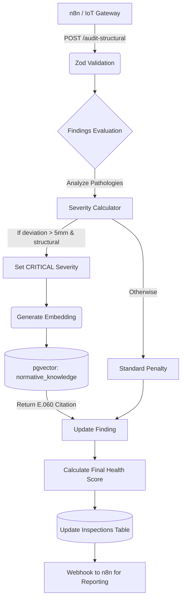

# SmartFacade360: Structural Audit Logic Validation

## 1. Overview
The **Structural Audit Service** evaluates physical anomalies detected by drone photogrammetry and LiDAR, strictly aligning with Peruvian Technical Standard **NTE E.060 (Concreto Armado)** to calculate a dynamic Building Health Score. This core component validates our TRL 5 status under the PROTTOM framework.

## 2. Mathematical Model: Building Health Score ($BHS$)
The $BHS$ starts at an optimal 100 points, applying weighted penalizations based on pathology severity and element criticality.

### Base Formula
$$ BHS = 100 - \sum_{i=1}^{n} (P_{severity, i} \times W_{element, i}) - E_{thermal} $$

Where:
- $n$ = Number of distinct findings in the inspection.
- $P_{severity}$ = Severity Penalty (Low: 5, Medium: 15, High: 25, Critical: 40).
- $W_{element}$ = Element Structural Weight (Structural Beam/Column: 1.5, Facade/Architectural: 1.0).
- $E_{thermal}$ = Green AI Metric (Thermal dissipation penalty, up to -5 points for severe heat envelope failure causing kWh loss).

### NTE E.060 Metric Thresholds
- **Critical Threshold (Structural):** Crack width metric deviation $> 5.0\text{mm}$ in beams or columns triggers an immediate **CRITICAL** state, forcing a $40$ point deduction and a mandatory RAG pull from structural normative tables.

## 3. RAG Architecture (Normative Knowledge Integration)
When a structural defect is identified, the system utilizes a **pgvector** similarity search to retrieve the exact article from NTE E.060.
1. Finding description is converted to a vector embedding (e.g., `vector(1536)` via OpenAI `text-embedding-adb-002` or local equivalent).
2. The Database runs `ORDER BY embedding <=> query_embedding LIMIT 1`.
3. The exact citation (e.g., *NTE E.060 Art. 10.4: Requisitos de resistencia a cortante...*) is attached to the finding's `nte_reference` field.

## 4. Execution Workflow

## 5. Economic & Ecosystem Impact (ROI)
The implementation of this automated, norm-compliant auditing process represents a projected **15% reduction in carbon footprint** by preemptively mapping thermal bridge failures and averting catastrophic material replacements, aligning strictly with Green AI mandates.
