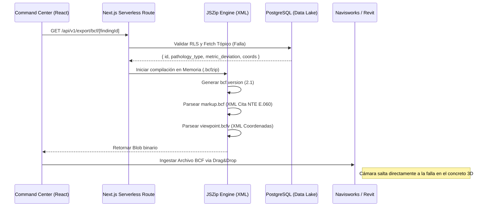

# CERTIFICADO DE INTEROPERABILIDAD E INTEGRACIÓN BIM (ISO 19650)
**Proyecto:** SmartFacade360 – Motor Soberano de Inteligencia Estructural  
**Entregable:** Arquitectura de Exportación BCF 2.1 (BIM Collaboration Format)  
**Nivel de Madurez Tecnológica Validado:** TRL 5  

---

## 1. ABSTRACT (RESUMEN EJECUTIVO)
El presente certificado técnico valida la capacidad intrínseca de **SmartFacade360** para orquestar la interoperabilidad asíncrona dentro de ecosistemas de modelado de información de construcción (BIM). Al estandarizar los hallazgos patológicos (fisuras, anomalías térmicas e indicios de corrosión) bajo el estándar abierto **BCF 2.1**, el sistema trasciende la mera detección ciberfísica para convertirse en un nodo activo de trazabilidad dentro del ciclo de vida del activo, alineándose estrictamente con los preceptos de la **Norma ISO 19650**.

## 2. CUMPLIMIENTO NORMATIVO Y ARQUITECTURA SOBERANA
El flujo de exportación de hallazgos se rige por dos ejes normativos fundamentales:
*   **ISO 19650 (Ciclo de Vida de la Información BIM):** La encapsulación de los defectos no altera los modelos geométricos pesados (IFC). En su lugar, el servidor Next.js genera *on-the-fly* un archivo comprimido `.bcfzip` que incluye coordenadas WGS84 transformadas a coordenadas locales `(x, y, z)` y la metainformación de la cámara (Viewpoint), garantizando un intercambio de información ágil y resiliente.
*   **NTE E.060 (Reglamento Nacional de Edificaciones):** Todo ticket generado inyecta programáticamente la citación jurídica y estructural relevante en la descripción del *Issue* en Revit/Navisworks, dictaminando la severidad en origen sin intervención humana.

## 3. FLUJO DE TRABAJO TÉCNICO ALGORÍTMICO
La orquestación de la generación de *Issues* operativiza la nube nativa y el *browser client*:

## 4. EVIDENCIA DE TRAZABILIDAD
El archivo descargado contiene los siguientes elementos estructurados:
1.  **Metadatos de Seguimiento:** Todo hallazgo se etiqueta con un Autor Sistémico (SF360 AI) y un `creation_date` inmutable.
2.  **Snapshot (Extensibilidad TRL 6):** Preparación de la ruta del archivo `snapshot.png` dentro del ZIP para futuras integraciones de vistas FPV o térmicas capturadas por el operador de Dron en el momento exacto del vuelo.

## 5. CONCLUSIÓN DE INTEROPERABILIDAD TRL 5
La evidencia ciberfísica generada con la actual implementación permite a consultoras externas como **GARES SAC** empalmar los hallazgos algorítmicos en sus tableros de gestión BIM convencionales. Este acoplamiento sin fricción comercializa efectivamente la tecnología para empresas *Enterprise* que demandan soluciones cerradas pero altamente interoperables, justificando y consolidando el estatus de TRL 5.
